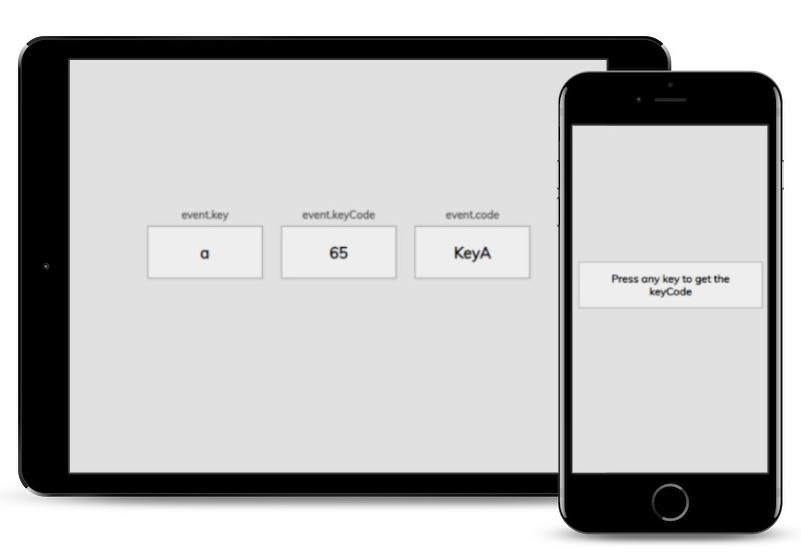

# Dad Jokes

This is the Event KeyCodes project (Day 11) in the [Udemy course 50 projects in 50 Days](https://www.udemy.com/course/50-projects-50-days/?src=sac&kw=50+projects+50+days).

## Project Details

The goal of the project is to grab what key the user presses on the keyboard and display the value of specific properties (key, keyCode, and code) for that key in the browser. 

### View My Project:

## Features

- Recognizes the key pressed on the keyboard by the user.
- Grabs specific properties of that key.
- Displays the value of those properties in the browser.

## Technologies Used

- HTML5
- CSS3
- JavaScript

## My Process

- Start the files from a boiler template.
- Create the container to display an instruction and templates for the key properties.
- Add styles for the container, key properties templates and page.
- Create a variable for the target element.
- Add an event listener to the browser window in order to detect the key the user has pressed.
- Copy the templates for the key properties from the index.html file, cut them from the file, and paste them in the JavaScript file to display on the page once a key has been pressed.

### Continued development

I enjoy working with keydown events in JavaScript and would like to utilize this project in some form of a cryptography application in the future. 

## Acknowledgements

Original Project idea: Brad Traversy, Florin Pop [Udemy course 50 Projects in 50 Days](https://www.udemy.com/course/50-projects-50-days/?src=sac&kw=50+projects+50+days)

Original HTML, CSS & Javascript provided by: Brad Traversy, Florin Pop [Udemy course 50 Projects in 50 Days](https://www.udemy.com/course/50-projects-50-days/?src=sac&kw=50+projects+50+days)